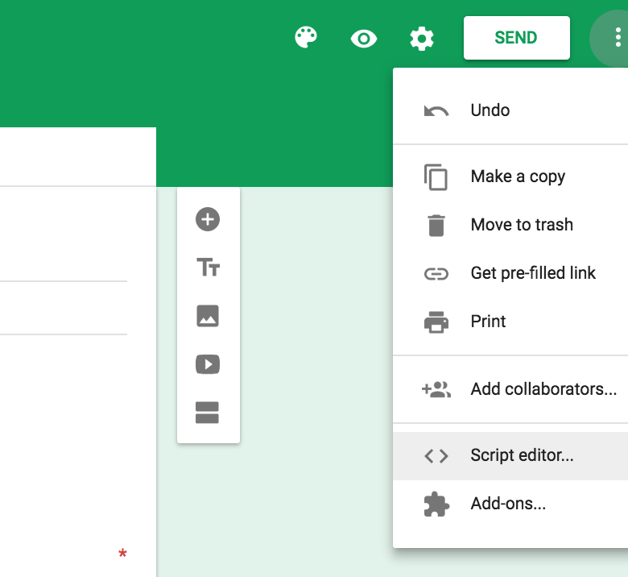
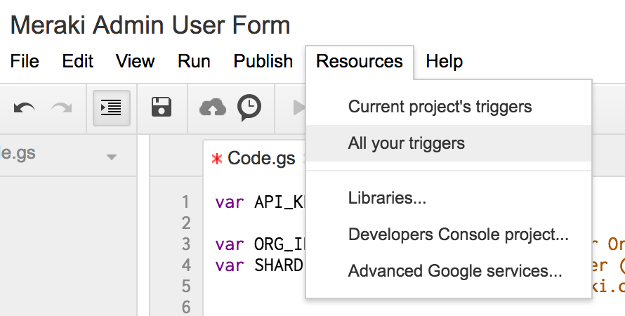
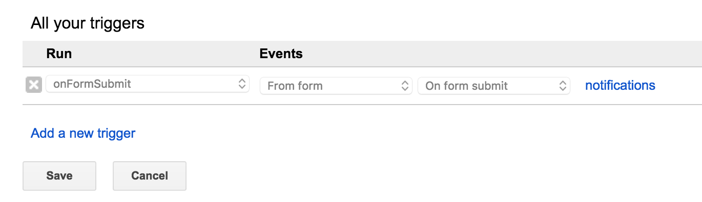
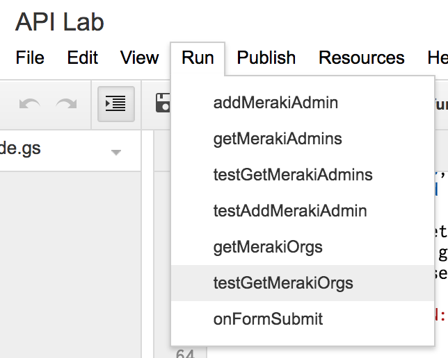
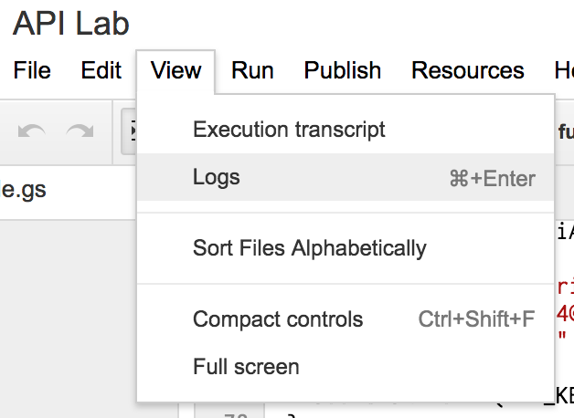
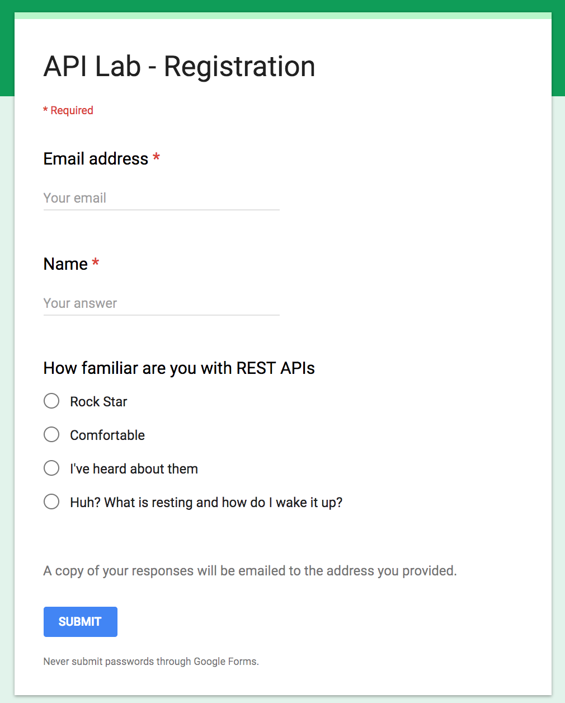

# Meraki Dashboard with Google Scripts & Forms

## Overview

This learning lab demonstrates the power of Meraki APIs with Google Scripts and Forms.

By building a simple Google Form and attaching a script written in JavaScript, a Meraki Dashboard administrator can easily be created. This is incredibly helpful when running workshops that require several administrators to have access to a lab network.

# Instructions
## Create a Google Form
https://forms.google.com

### The first two questions should be as follows:
- Email
- Name

[SAMPLE]


## Link the form to a Google Script




## Add a Trigger to launch the script when the Form is submitted.



### Configure the trigger
- Run: **onFormSubmit**
- Events: **From form**
- --> On form submit



## Test the API calls
Several additional functions are included in this code to allow you to test with sample data and collect information.  
- Run --> *Select a **test** function*



Feel free to modify the sample JSON data defined in the `testAddMerakiAdmin` function.

```
function testAddMerakiAdmin(){
  var data = {
    "name":"Google Scripts Demo",
    "email":"GoogleScriptsDemo@meraki.com", // change this to an email you have access to!
    "orgAccess":"full"
  };
  addMerakiAdmin(API_KEY,ORG_ID,SHARD,data);
}
```


## View the results
- View --> Logs




## Google Form
Now that the API calls are working, test the Google Form by hitting the preview button.


Complete the form with a valid email address.



If everything worked, you should get an email from Meraki asking to complete the admin account verification.


## Verify Meraki account is created
- Meraki Dashboard   > Organization   > Administrators

## SUCCESS!
With Google Apps, you do not even need to host a server to run the application\.


### Meraki API Resources
http://developers.meraki.com/
